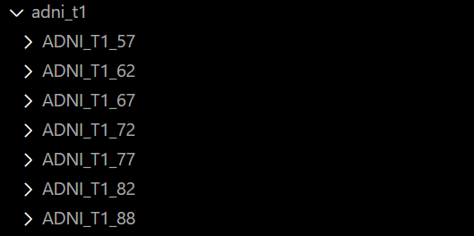
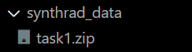

# Diffusion-based Ageing Synthesis

## Prerequisites

- All packages in the [requirements](requirements.txt) file. You can use ```pip install -r requirements.txt``` to install these automatically.

- A diffusion package of your choice. The author would recommend [AUTOMATIC1111's Stable Diffusion WebUI](https://github.com/AUTOMATIC1111/stable-diffusion-webui) and used this during development.

- The necessary datasets to process if training a model. Please see [Dataset Preparation](#dataset-preparation) for directions on how to format these. This project currently supports ADNI and Synthrad.

## How to use
(If creating a new model)
1. Download and prepare the datasets as indicated in [Dataset Preparation](#dataset-preparation).

2. Run the relevant preparation scripts for [ADNI](complete_adni_prep.sh) or [SynthRad](complete_synthrad_prep.sh).

3. Prepare class folders for different ages to classify.

4. Train model using prepared images. Convert to SAFETENSORS file.

(Start from here if only using existing model)

5. Import SAFETENSORS file into diffusion framework of choice.

6. Prompt for slice and age.

(To confirm data quality)

7. Run [evaluation script](evaluate_results.sh), linking to your evaluation dataset and generated images. Try to have a near-equal number of images in each.

## Dataset Preparation

### ADNI data preparation format:


### SynthRad data preparation format:
